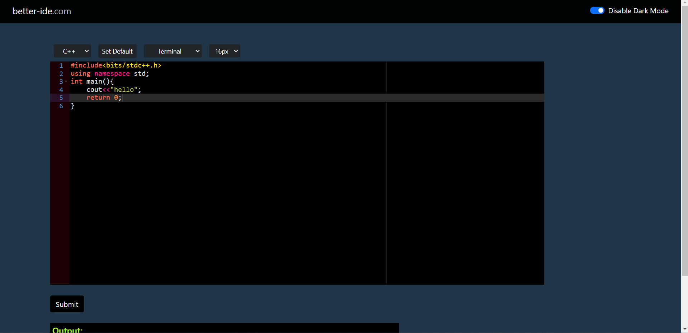
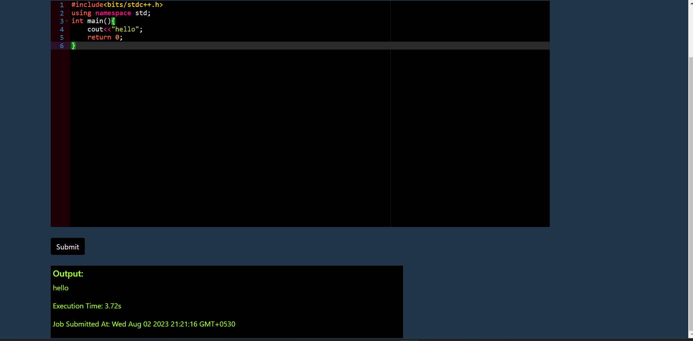
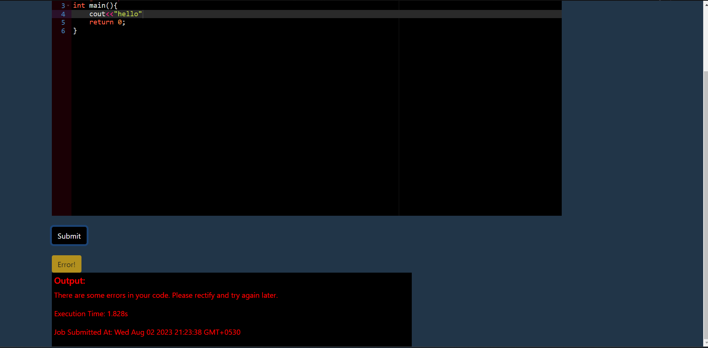
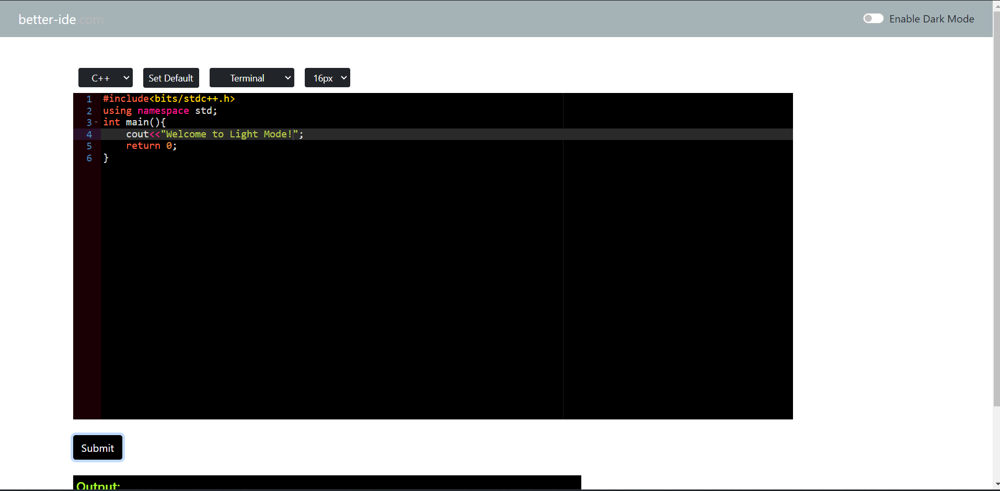
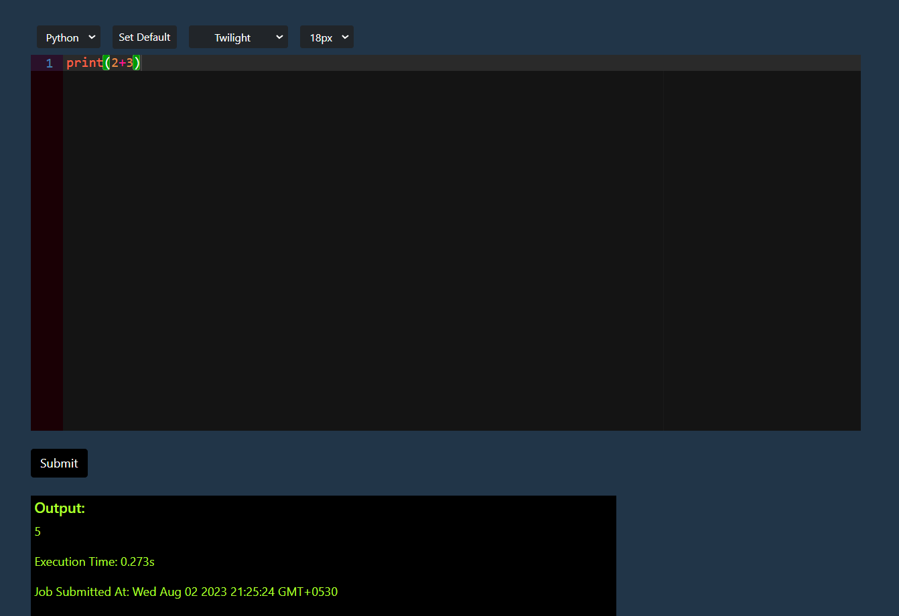

Welcome To Better Ide!

Techstack Used :-
<ul>
    <li>React (Frontend)</li>
    <li>NodeJs/Express (Backend)</li>
    <li>Ace Library (Code editor textarea)</li>
    <li>MongoDB (storing jobs)</li>
    <li>Bull Library/Redis (Queuing Mechanism)</li>
</ul>

<h3>A quick overview of Better IDE :-</h3>

https://github.com/neohacker18/Code-editor/assets/46134586/fcff8dcd-c172-4335-9e09-a535b3c3dca5

    <h5>Code Execution</h5>
    
    <h5>Output Window</h5>
    
    <h5>Error Detection</h5>
    
    <h5>You can also switch to the lightmode</h5>
    
    <h5>Better IDE also supports Python code execution.</h5>
    

